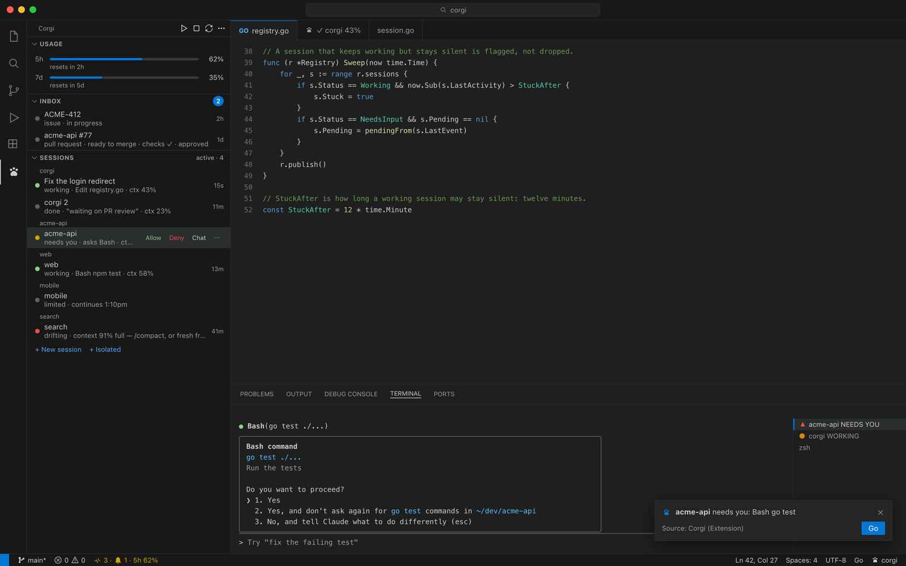
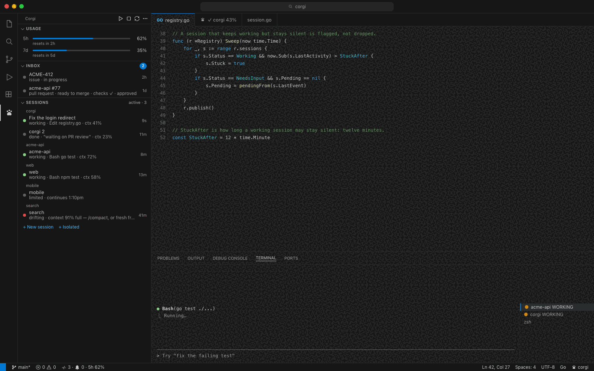
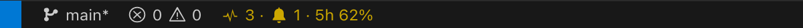
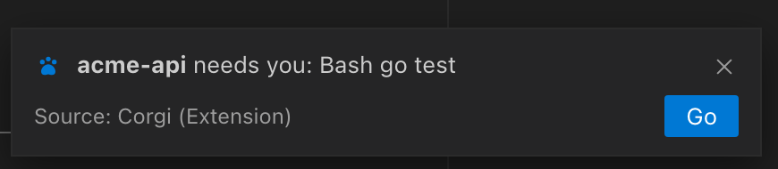
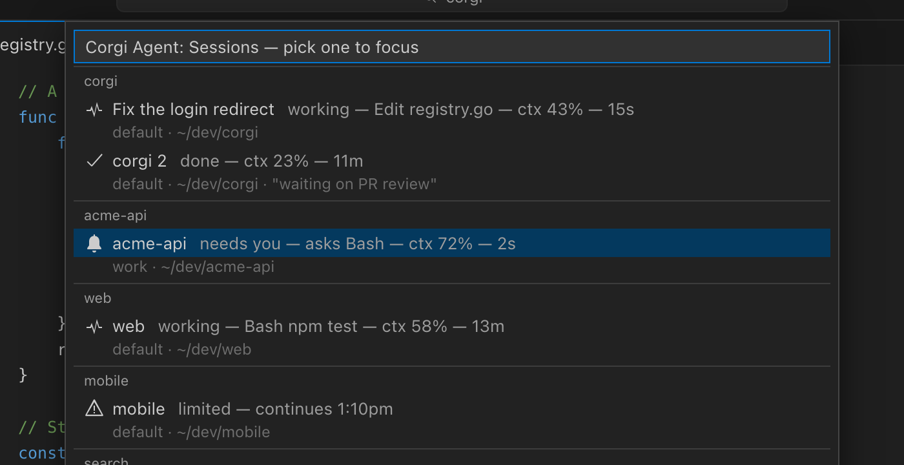

<div align="center">

# 🐶 Corgi vscode extension 🐶

[](https://sonarcloud.io/summary/new_code?id=Andriiklymiuk_corgi_vscode_extension)
[](https://sonarcloud.io/summary/new_code?id=Andriiklymiuk_corgi_vscode_extension)
[](https://sonarcloud.io/summary/new_code?id=Andriiklymiuk_corgi_vscode_extension)

[](https://sonarcloud.io/summary/new_code?id=Andriiklymiuk_corgi_vscode_extension)
[](https://sonarcloud.io/summary/new_code?id=Andriiklymiuk_corgi_vscode_extension)

[](https://sonarcloud.io/summary/new_code?id=Andriiklymiuk_corgi_vscode_extension)
[](https://sonarcloud.io/summary/new_code?id=Andriiklymiuk_corgi_vscode_extension)
[](https://sonarcloud.io/summary/new_code?id=Andriiklymiuk_corgi_vscode_extension)

[](https://sonarcloud.io/summary/new_code?id=Andriiklymiuk_corgi_vscode_extension)

Extension link in
[vscode marketplace](https://marketplace.visualstudio.com/items?itemName=Corgi.corgi)

Public docs in [corgi docs](https://andriiklymiuk.github.io/corgi/)

</div>

[Corgi](https://github.com/Andriiklymiuk/corgi) runs your project locally
with one command. Describe the stack once in `corgi-compose.yml`. `corgi run`
clones the repos, seeds the databases, writes the `.env` files and starts
every service. Run all of it, only the databases (`corgi db -u`), or only the
frontend against staging (`corgi run --tier staging --services web`).

In the editor this extension:

- highlights and autocompletes `corgi-compose.yml`
- runs corgi and its helpers (run, doctor, status, db, tunnel) from the
  activity bar, status bar and editor
- browses and runs the showcase examples
- answers as `@corgi` in Copilot Chat
- shows every Claude Code session on the machine (below)

## 🤖 AI assistant

**`@corgi` in Copilot Chat** knows the corgi-compose.yml schema and the CLI:

- `@corgi /new a go api with a postgres db`: scaffold a corgi-compose.yml
- `@corgi /explain`: explain the current compose file
- `@corgi /debug`: run `corgi doctor` and `corgi status`, diagnose
- `@corgi how do I add a redis cache?`: questions, answered from the docs

Each reply offers one-click **corgi doctor** / **corgi run** buttons.

**Copilot agent-mode tools**: Copilot can call corgi directly:
`corgi-status`, `corgi-doctor`, `corgi-validate`, `corgi-list` (read-only) and
`corgi-run` (asks before starting your stack). So "get my stack running and fix
issues" just works. Reference them explicitly with `#corgiStatus`, `#corgiDoctor`,
etc.

## Install corgi

The extension shells out to the corgi CLI. Install it once, either way:

- in VS Code: Shift+Cmd+P, `Corgi install with Homebrew`
- in a terminal:

```bash
brew install andriiklymiuk/homebrew-tools/corgi
corgi update      # later versions
```

Try it on an Expo + Hono example:

```bash
corgi run -t https://github.com/Andriiklymiuk/corgi_examples/blob/main/honoExpoTodo/hono-bun-expo.corgi-compose.yml
```

## Claude Code sessions

The corgi daemon keeps a board of every Claude Code session on the machine
([corgi agent mode](https://github.com/Andriiklymiuk/corgi/blob/main/docs/agent.md)).
This extension shows that board in VS Code.

<p align="center"></p>

**Agent sessions** view in the Corgi side bar. Workspaces, their sessions,
what each one does, context fill, time since the last change. Click a
session to focus its terminal tab or Claude Code panel. A session that waits
for a permission gets **Allow** and **Deny** buttons. Right-click to add a
note or dismiss.

<p align="center"></p>

**Status bar**: `⌁ 3 · 🔔 1 · 5h 62%`. Sessions working, sessions that wait
for you, the tightest 5-hour usage limit across accounts. The text turns
yellow when a session waits. Hover for the list. Click to pick one.

<p align="center"></p>

**Toast** with a **Go** button when a session in another window starts
waiting. Only the front window shows it (`corgi.agentToasts`).

<p align="center"></p>

**Auto-continue when limits reset.** A session that stops on a usage limit
sits dead until someone notices. Turn on `corgi.autoContinue.enabled` and
corgi sends one message to each limited session the moment its window
resets — no second extension, no daemon of its own.

It is off by default, and it never resumes anything quietly: while
something is queued, the status bar shows what and how long
(`api in 47m`, or `2 queued, next in 12m`). Click it to see the list and
cancel a session that should stay stopped, cancel all of them, or turn the
whole thing off. A cancelled session is only cancelled for this wait: its
next limit queues again.

`corgi.autoContinue.message` is what gets typed (default `continue`).
`corgi.autoContinue.graceSeconds` waits past the reset (default 60) because
the limit lifts on Anthropic's clock, not this machine's.

**Watch what runs for you.** `corgi agent watch --auto` fixes tickets and
review comments headless, in the background — a run takes minutes and only
speaks when it is over, so the editor gave no sign anything was happening.
Now the status bar spins with what it is on (`HUM-1338 7m`), a progress
notification follows each run, and when one opens a pull request it offers
to open it. Afterwards the bar reports what came out
(`1 from the watch`). Click it for the list: pick a row to open its PR.

`corgi.watchFixes.statusBar` and `corgi.watchFixes.progress` turn each half
off.

**Commands** (Shift+Cmd+P): Corgi Agent: Sessions (pick one to focus), New
Claude Code session in this window, Go to the session that needs you, Send
text to the front session, Talk to the front session, Auto-continue queue, What the watch worked on.

<p align="center"></p>

How it works: the extension sets `CORGI_VSCODE_WINDOW` in every terminal, so
a `claude` started there knows its window. It tells the daemon which
terminal tabs and Claude Code panels the window has. When `corgi agent
focus`, corgi-bar or a Stream Deck key asks, it reveals that tab. `corgi
agent new` opens a `claude` terminal (`corgi.claudeCommand`). `corgi agent
send` types text into the session's terminal as keystrokes, never as a
shell command.

It offers once to set `terminal.integrated.tabs.title` to `${sequence}`, so
a tab reads `▲ acme-api NEEDS YOU` instead of "claude". Nothing runs until
`corgi agent` has been used on the machine. `corgi.sessionTracking: false`
turns it off. If the Claude Code panel does not come forward, set
`corgi.claudePanelCommand` to the command that focuses it.

The same board is in the menu bar with
[corgi-bar](https://github.com/Andriiklymiuk/corgi-bar) and on Stream Deck
keys with [Corgi Agent Deck](https://github.com/Andriiklymiuk/corgi-agent-deck).

## Attribution

Credits:

- <a href="https://www.freepik.com/icon/pawprint_1076877#fromView=keyword&term=Dog&page=1&position=14">Icon
  by Freepik</a>
- <a href="https://www.freepik.com/free-vector/cute-corgi-dog-astronaut-floating-space-cartoon-vector-icon-illustration-animal-science-icon-concept-isolated-premium-vector-flat-cartoon-style_22271104.htm#query=corgi%20icon&position=7&from_view=keyword">Corgi
  image by catalyststuff</a>
